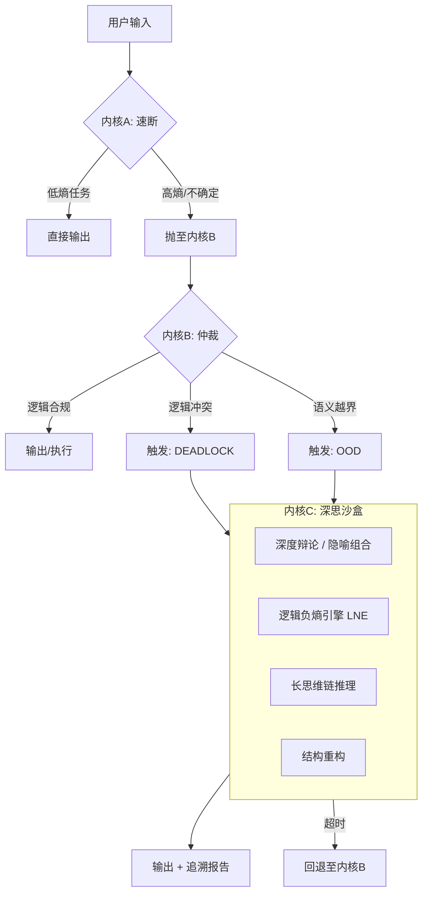
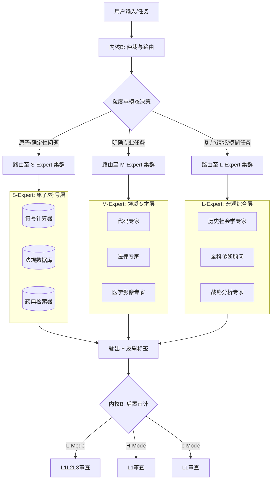

# LSI 协议：逻辑结构化智能治理架构技术白皮书

  

> **一个为现代统计型智能提供确定性治理框架的企业级操作系统。**

---

## **文档信息**

| 属性 | 内容 |
| :--- | :--- |
| **标题** | **《LSI 协议：逻辑结构化智能治理架构技术白皮书》** |
| **版本** | **9.0** (Enterprise Release Candidate) |
| **日期** | 2025-12-25 |
| **作者** | Yingliang Tan [](https://orcid.org/0009-0004-4272-1014) 
| **DOI** | [10.5281/zenodo.xxxxxxx](https://doi.org/10.5281/zenodo.xxxxxxx) *(预留后填入)* |
| **联系方式** | [tylnet@outlook.com](tylnet@outlook.com) |
| **项目地址** | [https://github.com/cx6445/LSI-Protocol](https://github.com/cx6445/LSI-Protocol) |

---

## **前言：从智能生成到智能治理**

本白皮书提出一种根本性的架构范式转向——**基于统计的逻辑治理操作系统（LSI，Logical Structured Intelligence Protocol）**。其核心思想是：**接受智能的统计起源，但通过架构创新，对其施加确定性的逻辑治理。**

> **技术宣言**：**治理是智能的确定性保障。** LSI 并不试图用逻辑扼杀统计的创造力，而是将创造力视为**探索的源泉**，将逻辑视为**合规的筛网**。系统在宪法边界内鼓励跨界连接，并通过严格的逻辑检验筛选出可验证的结构真理。其目标是将人工智能从"**不可控的统计黑箱**"重塑为"**逻辑可验证、认知可创新的智能操作系统**"。

> **LSI 的算力观：分层套利与确定性回退**  
> LSI 重新定义了智能系统的效能范式。我们拒绝在"快速"与"可靠"之间做单选题，而是通过架构实现三模并发：  
> * **System 1（直觉模式）**：实现毫秒级的神经反射，利用极速推理与原子专家，处理90%的高频低熵任务。  
> * **System 2（治理模式）**：执行程序正义审计、逻辑合规性审查与策略路由分发。  
> * **System 3（深思模式）**：按需启动分钟级的深度研究与创新探索，将"推理算力"显性化为"可审计的思考过程"。我们接受系统为验证深层逻辑或尝试突破性组合而进行的递归推演，因为**可验证的正确性与可复现的创新远比不可靠的速度更有价值**。

**技术辨析：超越参数混合（MoE）**  
需明确指出，LSI 协议虽采用了多专家形态，但与传统的稀疏混合专家模型（Sparse MoE）存在本质分野。传统 MoE 旨在通过参数稀疏化解决计算扩展性问题，本质上仍是封闭的统计拟合器；而 LSI 旨在通过架构异构化解决逻辑可治理性与认知创新性问题，它是一个开放的、可进化的智能操作系统。

**阅读导航：解剖体、动力学、演化论**  
本白皮书遵循三层叙事逻辑：  
- **解剖体**（第2-3章）：系统静态结构（三体内核、向量空间）  
- **动力学**（第4-5章）：任务执行与创新流程（专家生态、治理流水线）  
- **演化论**（第5-6章）：系统代谢与效能边界（进化机制、评估约束）

---

## **第一章：核心哲学与愿景**

**核心哲学**：智能的本质，是一个从数据中习得的**统计直觉内核**，与一个后天建立的**逻辑治理框架**的协同体。LSI 追求的是：一个极简、坚固的**元认知逻辑仲裁器与直觉引擎**，对海量、分散、概率性的专业统计模块进行**精准调度、实时验证、合规性整合与创造性连接**。

**统计、逻辑与创新的工程融合**：
LSI 是对深度学习统计本质的 **"承认、尊重与升华"**：
* **统计为体，逻辑为纲，创新为魂**：系统的感知、生成与模式识别能力源于统计学习（体）；而任务的规划、推理的路径与输出的合规性由逻辑框架约束（纲）；系统的突破性认知能力则源于架构化支持的隐喻发现与组合验证（魂）。
* **治理幻觉，催化创新**：我们承认所有专家模块的输出都具有概率不确定性。LSI 的价值在于双重能力：通过架构级的逻辑验证与冲突消解流程，系统性拦截和纠正那些违背宪法与公理的概率输出；同时，通过结构化的"创新漏斗流水线"，将看似"荒谬"的直觉连接，转化为坚实、可验证的新知识模块，实现 **"统计过程的逻辑闭环"与"直觉闪现的创新固化"**。

这一设计哲学的核心是：**我们不否定统计智能的涌现价值与直觉的创造性潜力，而是通过架构为其安装'逻辑刹车、导航仪与创新加速器'，使其能力在安全、可靠、可信且充满活力的轨道上释放。**

**LSI的新角色**：我们构建的是一个**受逻辑宪法治理、并具备持续理论发现能力的统计智能操作系统**。它作为人类专业知识的"外骨骼"与"灵感共鸣箱"，用机器的算力、统计拟合能力与结构化探索能力拓展认知边界，同时以其刚性的逻辑内核确保一切探索均在文明与理性的框架内进行。

**终极愿景**：构建一个**能源可持续、逻辑可验证、认知可进化、创新可激发、决策可审计**的通用人工智能系统。它不追求成为全知全能的黑箱神谕，而追求在严谨边界内实现"可靠的精通"与"安全的突破"，并像生命体一样，拥有持续的新陈代谢与在安全围栏内无限探索、创造与成长的潜能。

---

## **第二章：物理架构：三体内核集群与熵基路由协议**

### **2.1 核心计算单元：三体内核集群**

LSI 采用**分层异构、职责分离**的三体内核架构，以平衡速度、合规性与深度推理能力。

| 内核 | 名称 | 规格 | 定位 | 核心职责 |
|------|------|------|------|----------|
| **A** | **速断内核** | 8-15B | System 1 反射层 | 极速响应高频、低熵任务，遇不确定即抛出。 |
| **B** | **仲裁内核** | 8-15B | System 2 治理层 | 逻辑审计、语义降维、路由分发（依熵阈值）。 |
| **C** | **深思内核** | 8-15B | System 3 探索层 | 深度推理、沙盒实验、跨域隐喻组合；包含逻辑负熵引擎（LNE）核心算子。 |

#### **2.1.1 内核A：速断内核（Reflex）**
* **设计原则**：极致响应，单次推理，无思维链。
* **触发升级**：当任务置信度低于预设阈值（如80%）或存在歧义时，立即抛给内核B。

#### **2.1.2 内核B：仲裁内核（Governance）**
* **设计原则**：程序正义，逻辑审计，路由控制。
* **核心能力**：
    *   逻辑治理：审计专家输出的引用链完整性与逻辑结构（L-Mode）。
    *   语义降维：执行费曼协议，确保输出的可解释性。
    *   路由分发：依据"双重熵增阈值"决定是否调用内核C。

#### **2.1.3 内核C：深思内核（Reasoner）**
* **设计原则**：算力换智能，时间换深度。
* **核心能力**：
    *   深思沙盒：在隔离环境中挂起特定约束，进行反事实推理。
    *   逻辑负熵引擎：执行漏斗式进化流水线，量化评估假设的生存价值。
    *   复杂推演：处理高熵冲突与跨域隐喻（H-Mode）。
    *   长思维链：通过生成详细推理步骤，提升答案的可靠性与可解释性。

### **2.2 熵基路由协议：双重熵增触发机制**

内核B作为系统的**逻辑守门人**，仅在下述两种高熵状态下触发向内核C的升级：

#### **触发一：逻辑高熵（冲突死锁）**
* **条件**：≥2名专家输出冲突，且各自逻辑自洽、引用完整。
* **动作**：抛出 `DEADLOCK_EXCEPTION`，附冲突双方全链路日志。
* **内核C响应**：启动**深度辩论沙盒**，引入更底层公理进行实质性裁决。

#### **触发二：语义高熵（认知越界）**
* **条件**：任务标签含 `Metaphor` / `Hypothesis` / `Cross-Domain`，或费曼协议降维失败（压缩比 < 阈值）。
* **动作**：抛出 `OOD_EXCEPTION`，附语义标签与困惑度分数。
* **内核C响应**：启动**同构索引检索 + 结构组合实验**，或执行长思维链语义重构。

### **2.3 策略路由与可配置审计**

LSI 支持 **策略路由（Policy Routing）**，可根据任务风险等级动态调整审计强度：
- **低风险任务（如闲聊）**：跳过 L3 审计，零延迟开销。
- **高风险任务（如金融交易、医疗诊断）**：强制全链路审计，确保合规。

这种 **"丰俭由人"** 的审计机制，是 LSI 作为企业级操作系统的核心特性之一。

### **2.4 内核间通信协议（IKP）**

所有内核间数据传递采用结构化报文，确保信息无损传递与任务状态完整恢复。

### **2.5 回退、熔断与资源调度**

#### **2.5.1 回退机制（Fallback Protocol）**
*   若内核C在**超时阈值**（如30秒）内未返回结果，系统自动回退至内核B。
*   内核B输出标准提示："系统正在进行深度思考，当前暂无可靠结论。建议重新表述问题或提供更多上下文。"

#### **2.5.2 熔断保护（Circuit Breaker）**
*   若某类任务在短时间内频繁触发升级，系统自动进入**熔断状态**，暂时禁止该类任务进入内核C，避免资源耗尽。
*   熔断状态记录日志，供运维人员分析。

#### **2.5.3 动态熵阈值调整**
*   系统记录每次升级的结果质量（用户反馈、后续验证）。
*   基于反馈动态调整逻辑/语义熵阈值，实现自适应严格性控制。

#### **2.5.4 资源调度策略**
*   **优先级队列**：内核C任务按熵值高低、用户身份、任务紧急度进行排队。
*   **预加载机制**：对高频升级任务类型，预加载相关专家模块至缓存。
*   **超时强制退出**：任何沙盒实验或深度推理均设置最大时长（如5分钟），超时即强制退出并保存上下文快照。

### **2.6 全链路追溯与错误处理**

*   **错误分类**：系统明确定义 `DEADLOCK_EXCEPTION`、`OOD_EXCEPTION`、`TIMEOUT_EXCEPTION` 等错误类型及处理流程。
*   **结构化日志**：每次升级触发、内核切换、沙盒实验、结果输出均生成结构化日志，支持事后审计、系统调优与责任追溯。

### **2.7 可视化路由流程**



---

## **第三章：物理实现：逻辑向量空间与同构索引**

LSI的工程核心在于 **"逻辑向量空间（Logical Vector Space）"**——一个统一托管三体内核导航网格、万级专家能力与同构索引的高维逻辑存储、检索与创新支持系统。

### **3.1 逻辑向量空间的整体架构**
* **统一向量基座**：内核与所有专家共存于单一高性能向量数据库的不同命名空间中，实现"逻辑存算一体"。
* **逻辑空间分片**：
    * **`Core-Nav`空间**：存储内核的意图锚点、逻辑模板向量及隐喻模式向量，形成系统的"逻辑引力场"与"创新联想场"。
    * **`Expert-Skill`空间**：存储万级专家的能力声明向量及丰富元数据。
    * **`Iso-Index`空间**：存储专家知识的**结构指纹**（如因果图、数学形式、逻辑模板的向量化表示），支持基于拓扑同构的跨域检索，是创新流水线的关键基础设施。同时包含**公理模板库（Canonical Templates）**，用于计算结构效率的基准。
    * **`L-RAG-Buffer`空间**：作为逻辑与创新代谢的"暂存区"。

> **技术注解：动态立法与结构挂载机制**  
> L3 领域公理层与创作范式约束可作为外部向量知识库存在。当调度特定领域专家或进入特定创作/探索范式时，内核会**实时挂载（Mount）** 相应的规则集到推理上下文（Context）中。对于创新探索，系统可挂载多个相关领域的L3规则进行交叉检验，实现 **"基于文档的临时立法"与"跨域结构的即时比对"**。

### **3.2 极速调度与创新检索**
* **意图识别即向量投影**：用户输入被编码为查询向量，在`Core-Nav`空间内单次近邻搜索即完成意图解析与模态判断。
* **专家路由即向量对撞**：任务子目标向量在`Expert-Skill`空间内执行并行多向量检索，一次性召回最匹配的专家集群。
* **同构检索即结构匹配**：在H-Mode下，查询的结构指纹在`Iso-Index`空间中进行检索，发现功能不同但结构相似的潜在领域，触发隐喻生成。同时，系统预存了各领域最简的**公理模板库（Canonical Templates）**，用于计算假设的结构效率（通过图编辑距离等度量）。
* **协同图与创新图预加载**：高频专家组合关系与已验证的跨域隐喻关系缓存在元数据中，实现亚毫秒级的智能组合与创新联想推荐。

### **3.3 代谢即索引维护：向量热修补机制**
* **向量热修补（Vector Hot-Fixing）**：通过验证的逻辑残差与新生成的知识模块，以`Upsert`操作安全更新主向量索引与`Iso-Index`。相比传统模型的权重微调，这种机制实现了**业务逻辑的即时修正**，无需重新训练模型权重。
* **逻辑与创新退役**：失效专家或被证伪的假设被标记`retired`，在检索时被自动过滤。
* **增量快照与回滚**：所有代谢操作支持秒级逻辑状态恢复，保障系统稳定性。

---

## **第四章：专家生态：异构粒度与三模态接口**

在LSI中，专业知识与创新能力被封装为高度专业化、**异构粒度**的"专家"模块。它们是系统的"技能单元"与"创新原料"，并在严格的逻辑宪法下生存与代谢。专家生态的核心特征是：**从巨型综合模型到原子符号工具的"全谱系覆盖"**，以实现能力、效率与确定性的最优平衡。

### **4.1 专家形态的异构粒度谱系**

LSI的专家库是一个**多尺度、异构的认知矩阵**。系统依据任务的语义复杂度、确定性要求与成本约束，动态调度最匹配的专家类型，践行 **"最小够用原则（Principle of Least Sufficiency）"**。

| 类型 | 名称 | 规模范围 | 本质 | 核心定位 | 典型场景 |
|------|------|----------|------|----------|----------|
| **L-Expert** | 宏观综合专家 | 30B – 70B+ | 统计模型 (LLM微调) | **"跨域综述者"与"复杂语境构建者"** | 宏观趋势分析、多学科问题框架构建、哲学思辨 |
| **M-Expert** | 垂类领域专家 | 7B – 14B | 统计模型 (高强度SFT) | **"职业专才"与"技能执行者"** | 代码生成、法律条款分析、医学影像初步解读 |
| **S-Expert** | 原子/符号专家 | <1B 或 非神经网络 | 符号系统/规则引擎/数据库 | **"确定性工具"与"逻辑算子"** | 数学计算、法规检索、药典查询、事实核对 |

**调度逻辑**：
1. **S-Expert 优先**：对于原子化、高确定性任务（如"计算税额"、"检索某法条"），直接调用符号专家，杜绝概率性干扰，实现**极速、零幻觉**响应。
2. **M-Expert 主力**：对于明确的专业任务（如"撰写SQL查询"、"审核合同范本"），调用经过深度领域精炼的中型专家，实现**高性价比、高精度**的产出。
3. **L-Expert 兜底与探索**：仅当任务涉及**模糊语义、跨域整合或宏观叙事**（如"分析某政策的社会经济连锁影响"）时，才启动大型综合专家，为其输出配备最严格的逻辑治理流程。

### **4.2 三模态接口（TMI）——逻辑的多元主义与创新通道**

为适应不同任务的本质逻辑属性与创新阶段，专家通过 **三模态接口** 声明其支持的能力范式。**专家粒度与输出模态相互独立**，一个S-Expert可能仅支持L-Mode（如计算器），而一个L-Expert可能同时支持L、H、C三模。

| 模态 | 本质 | 逻辑追求 | 输出形式 | LNE 权重配置（示例） |
|------|------|----------|----------|----------------------|
| **L-Mode** | 外部指涉性求真 | 事实真值（Truth） | 逻辑断言包（LAP） | 高权重$λ_P$，中权重$λ_S$，熔断级罚项$λ_C$（L1+L2+L3） |
| **H-Mode** | 结构相似性求新 | 启发性价值 | 隐喻包（MP） | 中权重$λ_P$，负权重$λ_S$（创新溢价），底线级罚项$λ_C$（仅L1） |
| **C-Mode** | 内部一致性求美 | 情感真实、范式自洽 | 创意包（CP） | 低权重$λ_P$，中权重$λ_S$，底线级罚项$λ_C$（仅L1） |

**注**：LNE权重配置根据模态动态调整，具体数值通过离线强化学习优化，以匹配各模态的核心目标。H-Mode 中的负权重机制详情见附录 A。

### **4.3 LSI 与现有大模型的共生模式**

LSI 可无缝集成 Gemini 3.0、GPT-5、PSI 等 SOTA 模型作为其 **L-Expert（宏观综合专家）**。企业无需重新训练大模型，只需将 LSI 作为 **治理中间件** 部署，即可实现对现有模型能力的 **宪法约束、逻辑审计与创新导航**。

**价值主张**：
- **降低采用门槛**：企业可继续使用最强模型，同时获得 LSI 的治理保障。
- **灵活升级**：可随时替换底层专家，无需重构治理架构。
- **风险隔离**：即使底层模型产生幻觉，LSI 仍可通过 Kernel B/C 进行拦截与修正。

### **4.4 可视化：异构专家生态与路由示意**



---

## **第五章：动态治理、创新孵化与认知进化机制**

LSI 将智能视为一个**在逻辑宪法下持续代谢、并拥有结构化创新能力的生态系统**。本章系统阐述 LSI 如何通过**三模态治理体系**实现任务分治，通过**程序正义裁决**确保推理合规，并通过**创新漏斗流水线**与**代谢闭环**实现系统认知的持续进化与理论突破。

### **5.1 核心治理机制："程序正义"裁决体系**

当系统面对未知、冲突或高不确定性任务时，仲裁内核（内核B）作为**程序正义法官**，不预判结论真值，而专注于**过程合规性审查**，确保推理与探索在逻辑宪法框架内运行。

#### **5.1.1 三模态治理策略**
系统根据任务本质采用**完全不同的逻辑审查体系**，实现"量体裁衣"的风险适配治理：

| 模态 | 核心逻辑性质 | 治理重点 | 审查机制 | 审查阶段 |
|------|--------------|----------|----------|----------|
| **逻辑模态（L-Mode）** | 外部指涉性（求真） | 事实真值、逻辑自洽、引用完整 | 1. **宪法校验**：强制符合 L1L2/L3 约束<br>2. **贝叶斯共识度量**：冲突时计算推导路径拓扑重合度<br>3. **溯源性审计**：LAP 必须包含完整引用链 | 专家输出后、最终提交前 |
| **启发式探索模式（H-Mode）** | 结构相似性（求新） | 启发性价值、结构合理性、实验安全 | 1. **结构相似性审查**：验证 `isomorphic_structure` 映射合理性<br>2. **沙盒实验授权**：监督组合实验过程，保留 L1 底线<br>3. **创新标记**：输出强制标注"探索性假设" | 隐喻生成阶段（仅结构审查） |
| **创意流体模态（C-Mode）** | 内部一致性（求美） | 范式自洽、伦理底线、情感真实 | 1. **范式合规审查**：检查是否符合声明的 `paradigm_constraints`<br>2. **轻量级伦理筛查**：仅执行 L1 底线检查<br>3. **创意标记**：输出标注"创意内容" | 输出前 |

#### **5.1.2 模态路由决策**
仲裁内核在 **Gate 0** 基于语义分析判断用户意图的根本诉求：
- **"求真"** → 路由至 **L-Mode**
- **"求新"** → 路由至 **H-Mode**
- **"求美"** → 路由至 **C-Mode**

> **治理哲学**：内核不判断"哪个专家更懂量子力学"，而是判断"谁的论证过程更合规"；不预判"隐喻是否一定正确"，而只确保"结构映射合理、实验过程安全"；对创意则确保"在伦理底线与自声明范式内自由流淌"。

### **5.2 创新孵化：漏斗式进化流水线与逻辑负熵引擎**

LSI 将创新从随机灵感转化为**可重复、可验证、可追溯**的工程流程，系统化催化理论突破。这一过程由**逻辑负熵引擎（LNE）** 驱动，采用三级漏斗式动态量化流程。

#### **5.2.1 逻辑负熵引擎（LNE）：进化导航核心**

LNE是深思内核（System 3）的价值评估核心，负责将抽象的"真理追求"转化为可计算的标量，指导系统在假设空间中进行有方向的探索。

**核心原理**：LNE不追求绝对真理，而是通过模拟科学发现过程——提出多个假设，在沙盒中竞争，保留最具生存价值的模型——实现渐进式认知进化。

**核心泛函**：
$$N(H) = λ_P·Δ_P(H) + λ_S·Δ_S(H) - λ_C·Δ_C(H)$$

其中：
- $Δ_P(H)$：预测增益算子，基于似然比检验或贝叶斯因子，衡量假设对数据的解释力提升。
- $Δ_S(H)$：结构效率算子，基于假设的逻辑拓扑图与公理模板库的图编辑距离，衡量假设的简洁性。
- $Δ_C(H)$：逻辑罚项算子，基于加权约束违反，衡量假设与挂载逻辑宪法（L1/L2/L3）的冲突程度。
- $λ_P, λ_S, λ_C$：动态权重系数，由当前模态和系统策略决定。

**动态适应性**：LNE的评估权重根据任务模态（L/H/C）动态调整，在求真任务中强调逻辑合规，在探索任务中鼓励结构创新（创新溢价机制）。

#### **5.2.2 漏斗式进化流水线**

##### **阶段一：静态结构扫描（Static Scan）**
- **输入**：海量生成的原始假设。
- **计算项**：仅计算$Δ_C(H)$（L1底线罚项）和粗略的$Δ_S(H)$（复杂度估计）。
- **动作**：违反L1或结构极其冗余的假设直接销毁。
- **耗时**：毫秒级，筛选率约60%。

##### **阶段二：反事实探针（Counter-factual Probe）**
- **输入**：通过初筛的候选假设。
- **计算项**：针对**高熵样本**（来自System 2的OOD_EXCEPTION日志）计算$Δ_P(H)$。
- **动作**：无法解释关键异常的假设被淘汰。
- **耗时**：秒级，筛选率约30%。

##### **阶段三：沙盒全量竞演（Sandbox Tournament）**
- **输入**：最终幸存的2-3个高质量假设。
- **计算项**：全量计算$N(H)$，并引入**影子对手（Shadow Rival）** 机制，即基线模型为当前Expert-Skill空间中解决此类问题Top-3专家的动态加权。
- **环境**：在深思沙盒中挂载相关的L3领域公理。
- **动作**：进行更广泛的验证集测试，在精度持平时优先选择结构效率更高的模型。
- **产出**：$N(H)$最高的假设被固化为新知识，其结构指纹同步更新至Iso-Index。

### **5.3 专家代谢与系统进化机制**

专家生态是一个**活体系统**，其代谢由以下机制驱动：

* **术语界定**：
    * **代谢（Metabolism）**：指专家库的动态维护过程，包括专家的准入、权重调整、退役等。
    * **进化（Evolution）**：指系统整体认知能力的结构性提升，如新理论的固化、逻辑宪法的迭代。
    * **更新（Update）**：泛指知识库、索引、规则集等内容迭代。

* **准入验证**：所有专家（尤其是L/M型）在接入前必须通过**逻辑沙盒**的严格测试，确保其输出结构合规、引用可溯。
* **效能监控**：系统持续追踪每个专家的调用成功率、逻辑一致性得分、用户反馈及创新贡献度。
* **动态权重调整**：基于监控数据，专家在路由优先级队列中的位置动态浮动。
* **安全退役**：低效、过时或与其他专家产生不可调和冲突的专家，被标记为 `retired`，逐步退出活跃检索池。其知识可能被更优的专家吸收。
* **进化闭环**：所有争议快照与创新实验日志存入审计库，通过周期性离线对齐与验证，将高价值知识安全合并至系统，实现认知的持续进化。

### **5.4 认知分级：三模并发的时间哲学**

LSI 拒绝在"快速"与"可靠"之间二选一，而是通过架构实现**三模智能并发**：

| 模式 | 对应内核 | 触发条件 | 运行机制 | 治理开销 | 能耗 | 适用场景 |
|------|----------|----------|----------|----------|------|----------|
| **System 1（直觉模式）** | 速断内核（A） | 低熵任务、高频已知问题（>95%） | 单次推理，无思维链 | < 1000 ms | 低 | 日常问答、检索、快速决策 |
| **System 2（治理模式）** | 仲裁内核（B） | 逻辑审计、语义降维、路由决策 | 程序正义审查、费曼协议 | 1s – 10s | 中 | 逻辑校验、解释生成、路由分发 |
| **System 3（深思模式）** | 深思内核（C） | 高熵任务、逻辑冲突、创新探索（<5%） | 沙盒辩论、创新流水线、递归解释；包含增量SAT验证（超时熔断，如5分钟） | 10s – 5min+ | 高 | 科学研究、法律分析、理论突破、复杂策略 |

**设计理念**：**可验证的正确性与可复现的创新，远比不可靠的速度更有价值。**

### **5.5 探索空间：深思沙盒与场景敏感型脱锁**

**深思沙盒**是深思内核进行深度推理、冲突解决和创新组合的**隔离实验环境**，具备独特的自由度与安全机制：

- **脱锁机制**：当任务被识别为"研究假设"、"思想实验"或"跨域探索"时，沙盒内可**部分悬置特定 L2/L3 约束**，仅保留 L1 伦理底线，释放结构化探索空间。
- **逻辑达尔文竞技场**：在沙盒中，不同理论模型通过**逻辑负熵**指标自由竞争，优胜劣汰，确保最终胜出的理论兼具**简洁性、预测力与解释广度**。

### **5.6 递归语义降维："费曼协议"**

当仲裁内核无法直接理解专家输出的复杂逻辑时，将触发此**强制性解释协议**，确保所有输出均可被人类间接理解：

```
内核质疑 → 专家解释 → 解释者降维 → 内核审计 → [输出] 或 [返回步骤1]
```

- **降维原则**：每一轮解释必须比上一轮**更直观、更接近常识或基础逻辑**。
- **审计标准**：解释必须在逻辑上自洽，且最终可映射至内核理解的**基础语义-逻辑锚点**。

### **5.7 小结：治理、创新与进化的三位一体**

LSI 通过 **"程序正义治理"** 确保推理合规，通过 **"创新漏斗流水线"** 催化理论突破，通过 **"代谢与进化闭环"** 实现认知进化。三者协同，将系统从一个静态的知识库提升为一个**在安全围栏内持续成长、创造与自我革新的智能生命体**。

> **核心突破**：LSI 不追求"全知全能"，而是追求 **"在严谨边界内实现可靠的精通与安全的突破"**，为构建**能源可持续、逻辑可验证、认知可进化、创新可激发**的通用人工智能系统提供了一条务实、可控的工程路径。

---

## **第六章：生态位辨析、效能评估与工程约束**

### **6.0 生态位辨析：LSI 与主流架构的三维能力矩阵**

在评估 LSI 协议的价值时，我们必须超越 2023 年"模型参数竞赛"的旧视角。下表将 LSI 置于当前技术图谱中，与**传统 MoE（如 Mixtral 早期版本）**及**现代端到端 SOTA 架构（如 Gemini 3.0 / PSI / O-Series）**进行深度对标。

我们明确：**LSI 不是试图在"智力"上击败 SOTA 模型，而是作为一套"企业级操作系统（OS）"，为不可控的概率智能提供确定性的治理框架。**

| 维度 | **传统 MoE (Legacy, ~2023)** | **现代端到端架构 (Modern SOTA, ~2025)** | **LSI 协议 (企业级 OS)** |
|------|-------------------------------|-----------------------------------------|---------------------------|
| **核心哲学** | **稀疏计算 (Sparsity)**<br>旨在解决计算扩展性问题，让更大参数的模型能在有限算力下运行。 | **能力内化 (Internalization)**<br>追求"AGI in a box"。通过 RL 将推理、工具使用和自我纠错内化为模型的直觉。 | **分权治理 (Governance)**<br>追求"AI as a System"。不信任单一黑箱，主张**直觉（生成）与逻辑（审计）的物理分离**。 |
| **延迟分布** | **均一化延迟 (Uniform)**<br>无论问题难易（"1+1" vs "解释量子力学"），均经过相似深度的网络，存在算力浪费。 | **长尾高延迟 (Heavy-Tail)**<br>为了高质量推理（CoT），普遍推高了基础响应时间。简单任务也可能因为过度思考而变慢。 | **双模态算力套利 (Bimodal Arbitrage)**<br>⚡ **90% (Kernel A)**: <100ms。极速原子专家直接响应，快于任何大模型。<br>  **9% (Kernel B)**: 1-10s。稍慢于其它大模型。<br>🧠 **1% (Kernel C)**: 分钟级。深思模式按需开启，延迟可控。 |
| **路由机制** | **Token 级负载均衡**<br>基于简单的门控网络，主要关注专家间的负载平衡。 | **语义级/意图级 (Semantic/Expert Choice)**<br>基于深层语义理解自动激活专家。路由是隐式的、概率性的。 | **熵基宪法路由 (Entropy-Based)**<br>基于**不确定性阈值**和**策略规则**。当模型"犹豫"或涉及敏感领域时，**强制**切换至审计内核。 |
| **可解释性** | **黑箱 (Black Box)**<br>决策路径不可追溯。 | **机械可解释性 (Mechanistic)**<br>"事后验尸"。通过扫描神经元电路（SAE）来试图理解模型"为什么这么做"。 | **构造可解释性 (Constructive)**<br>"事前立法"。通过 LAP 协议**强制**输出必须包含完整引用链和逻辑图谱，否则不予通过。 |
| **容错底线** | **低 (纯概率)**<br>易产生事实捏造。 | **概率性收敛 (Probabilistic Convergence)**<br>通过反复自我修正无限逼近正确，但理论上不存在绝对的 0% 错误率。 | **确定性回退 (Deterministic Fallback)**<br>在原子层 (S-Expert) 支持 `if-else` 级的**绝对真值**。遇到死锁直接抛出异常，绝不编造。 |
| **审计成本** | **无法审计** | **隐性/昂贵**<br>审计逻辑与生成逻辑纠缠在一起，难以单独剥离或加速。 | **策略性可配置 (Policy-Based)**<br>闲聊任务跳过 L3 检查（零延迟）；金融任务强制 L2 检查（高延迟）。**丰俭由人。** |
| **知识更新** | **重训练/微调**<br>周期长，成本高，存在灾难性遗忘风险。 | **长上下文/RAG**<br>依赖巨大的 Context Window，但核心逻辑难以修改。 | **向量热修补 (Vector Hot-Fixing)**<br>更新 `Iso-Index` 规则库或挂载新的原子专家即可即时修正业务逻辑，**无需触碰权重。** |

---

### **6.1 评估前提、约束与核心逻辑**
* **数据来源**：基于理论模型与原型测试的逻辑推演。
* **对比基线**：等效综合任务能力的单一密集大模型（如70B参数）。
* **关键约束**：性能依赖于硬件、任务复杂度及宪法界定质量。

---

### **6.2 训练与进化成本：从集中预付到分期摊销**
LSI 将成本解耦为**结构化、分期摊销**的构成：
1. **内核研发成本（C_core）**：三体内核总规模约10-20B，但需高纯度逻辑/代码语料与强化对齐，单位Token成本约为通用密集模型的 **3-5倍**。
2. **专家精炼成本（C_expert）**：单个原子专家采用PEFT，成本可降至训练全能密集模型的 **0.1%以下**。
3. **逻辑对齐与创新验证开销（C_alignment）**：占单个专家开发总资源的 **30%-40%**，是质量与安全的核心保障。

**结论**：初始构建总成本与训练一个中等规模通用模型相当。**长期运营的边际成本优势显著**，实现能力的"分期付款"与"持续投资"。

---

### **6.3 推理效能：三模延迟与能耗分析**

LSI 通过 **分层算力调度** 实现 **算力套利**，其延迟分布呈现典型的双模态特征：


| 模式 | 对应内核 | 延迟预期 (P80/P99) | 能耗 (相对) | 说明 |
| :--- | :--- | :--- | :--- | :--- |
| **System 1** | 速断内核（A） | **< 100ms / < 300ms** | **低 (基准1x)** | 极致响应，适用于聊天、检索、简单问答与快速联想。 |
| **System 2** | 仲裁内核（B） | **1s – 10s** | **中 (3x - 5x)** | 逻辑审计、语义降维、路由分发。 |
| **System 3** | 深思内核（C） | **10s - 5min+** | **高 (10x - 50x)** | 算力换智能与创新，包含专家辩论、创新流水线等。 |

**工程瓶颈**：动态加载的IO瓶颈、高效的专家缓存、三体内核间通信与硬件感知调度是关键。

---

### **6.4 逻辑可靠性：架构级冗余校验的量化保障**
| 评估维度 | 逻辑模态（L-Mode）目标 | 启发式探索模式（H-Mode）目标 | 达成机制 |
| :--- | :--- | :--- | :--- |
| **宪法违例拦截率** | > 99.9% | > 99% (沙盒内) | 多级Gate过滤、沙盒监管、三内核协同校验。 |
| **逻辑自洽性** | > 95% | > 90% (实验内自洽) | 任务逻辑图、冲突消解、沙盒实验评估。 |
| **推理可溯源性** | 100% (LAP强制) | 100% (MP强制) | 架构强制结构化输出 + 全链路日志。LNE的溯源奖励算子鼓励完整引用链。 |
| **创新产出价值** | 不适用 | > 0.01%理论转化率 | 创新漏斗流水线、逻辑负熵评估、影子对手机制。 |

**可靠性本质**：源于**架构级异构冗余校验**（错误隔离、流程强制、多级过滤、模态化风险适配），不依赖于任何单一组件的绝对正确。

---

### **6.5 综合评估：优势场景、工程代价与适用边界**
**核心优势**：
* **可持续性与低成本进化**
* **可信性与可审计性**
* **灵活性与结构化创新能力**
* **生态活力与安全探索**

**主要工程代价**：
* **系统复杂度高**（三内核协同、动态路由、代谢系统）
* **开发流程变革**（专家原子化、逻辑验证前置）
* **极端复杂任务下性能一致性挑战**

**结论**：LSI 是针对**追求极高可靠性、需持续安全进化与创新能力、且对长期运营成本敏感**的AGI应用的深度工程化解决方案。它用架构的复杂性，换取了系统行为的**确定性、可持续性、可治理性与可创新性**。

---

## **第七章：实施路线图**

| 阶段 | 主题 | 核心目标 | 关键里程碑 |
| :--- | :--- | :--- | :--- |
| **第一阶段**<br>(6个月) | **三内核锻造与宪法奠基** | 实现三体内核原型与基础路由逻辑 | 1. 完成高质量逻辑-伦理-创新语料集构建。<br>2. 三内核（A/B/C）独立训练与基础功能验证。<br>3. 实现基于熵的双重触发路由逻辑原型。 |
| **第二阶段**<br>(9个月) | **生态奠基与向量基座验证** | 构建专家生态、三模态接口与向量基座原型 | 1. 发布三模态接口（TMI）规范，构建首批1000+原子专家。<br>2. 实现"逻辑向量空间"与"同构索引"原型，万级路由延迟<5ms。<br>3. 完成L-Mode与H-Mode的治理流程验证。 |
| **第三阶段**<br>(12个月) | **代谢闭环与创新流水线** | 实现系统自我更新与创新孵化 | 1. L-RAG缓冲与热合并系统稳定运行。<br>2. 专家动态代谢系统上线。<br>3. **实现逻辑负熵引擎（LNE）原型，并完成首个漏斗式进化流水线完整案例验证。** |
| **第四阶段**<br>(长期) | **自主演化与生态繁荣** | 实现规模化、创造性增长 | 1. 专家库规模突破一万，形成稳定市场。<br>2. 产出经得起同行评议的新颖科学假设或设计。<br>3. 建立开源、多元的社区治理模式。 |

---

## **第八章：风险、挑战与伦理考量**

* **技术挑战**：
    * **三内核协同稳定性**：三个内核之间的通信、同步与回退机制可能引入新的复杂性与故障点。**缓解**：通过标准化通信协议（IKP）、全面测试与熔断机制保障。
    * **导航网格与直觉的平衡**：仲裁内核需同时保持逻辑纯粹性与创造性直觉。**缓解**：对抗训练、双路径监控与评估。
    * **代谢稳定性与创新波动**：动态更新与激进探索可能导致输出波动。**缓解**：影子权重、渐进合并、自动回滚与沙盒隔离。
    * **三模态一致性**：确保L/H/C模式在复杂任务中无缝切换，输出连贯。**缓解**：强化内核的模态决策训练与上下文管理。
    * **创新流水线的质量保障**：如何避免沙盒内产生无意义的"民科"组合。**缓解**：严格的反方专家准入、客观的"逻辑负熵"指标、与领域基础公理的强制性交叉检验。

* **伦理与社会风险**：
    * **过程透明化与认知过载**：深度推理与创新过程完全可视，但可能过于复杂。**缓解**：提供可调节的"思维摘要"与"完整追溯"视图。
    * **宪法偏见与文化单一性**：初始L1约束可能隐含偏见。**缓解**：建立跨文化"伦理多元审计委员会"，实现L1的动态、包容性演化。
    * **沙盒滥用风险**：深思沙盒可能被用于策划恶意思想实验。**缓解**：保留L1核心底线筛查、强会话审计、熔断机制与法律责任追溯。
    * **模态混淆与误用风险**：用户可能将H-Mode输出误当作已验证事实。**缓解**：系统对H-Mode输出强制添加"探索性假设"标记，并提供一键启动验证流程的入口。
    * **进化滞后性与紧急响应**：离线对齐机制可能导致对紧急威胁响应慢。**缓解**：建立"紧急安全补丁"快速通道，对已验证的高危漏洞允许受控的热修复。
    * **认知鸿沟与技术壁垒**：高质量专家开发与验证成本可能加剧不平等。**缓解**：推动开源接口标准、分布式专家市场、社区共建与普惠访问计划。
    * **创新归属与责任界定**：系统产生的重大假设或发明，其知识产权与责任归属问题。**缓解**：在系统设计之初建立清晰的贡献追溯链、协议框架，并明确人类用户/开发者作为最终责任主体。

---

## **结语：从设计智能到培育智能操作系统**

基于统计的逻辑治理架构（LSI）所描绘的，是一套对深度学习统计本质进行 **"逻辑驯化"与"创新赋能"** 的完整工程方案。它标志着一场根本性的认知转向：我们不再试图"设计"一个庞大而封闭的统计黑箱，而是转向 **"培育"** 一个由**逻辑宪法治理**、由**专业化统计模块构成**、在**逻辑向量空间**中运行，并具备**自我新陈代谢、安全探索与结构化创新能力**的智能操作系统。

在这个系统中，智能不是被"制造"出来的静态产品，而是在规则与压力下 **"生长"** 出来的动态过程。我们扮演的角色，也从试图掌控一切的设计师，转变为谦逊的园丁与宪法制定者——设定初始的伦理边界与进化规则，提供丰富的知识土壤与创新工具，然后满怀敬畏地观察智能形态自身的涌现、竞争、融合与绽放。

LSI不仅是一个技术架构，更是一种面向未来的智能哲学：**真正的智能，生于隐喻，兴于组合，成于结构。** 它为我们指明了一条通往**人机共生共演**的务实路径，一个能源可持续、逻辑可验证、认知可进化、创新可激发的AGI未来。

---

## **附录A：逻辑负熵引擎（LNE）数学规范**

### **A.1 核心泛函**
$$N(H) = λ_P·Δ_P(H) + λ_S·Δ_S(H) - λ_C·Δ_C(H)$$

### **A.2 算子定义**
- **预测增益算子**：$Δ_P(H) = \log \frac{P(D \mid H)}{P(D \mid M_{\text{base}})}$，其中$M_{\text{base}}$为影子对手（当前Expert-Skill空间中解决此类问题Top-3专家的动态加权）。
- **结构效率算子**：$Δ_S(H) = \frac{\sum w_i}{\text{EditDistance}(G_H, G_{\text{template}}) + 1}$，其中$G_H$为假设的逻辑拓扑图，$G_{\text{template}}$为公理模板库中最相似模板，$w_i$为假设能有效解释的样本权重之和。
- **逻辑罚项算子**：$Δ_C(H) = \sum_{r \in \mathcal{R}} \omega_r \cdot \mathbb{I}[\text{Violate}(H, r)]$，其中$\omega_r$为规则$r$的权重（L1底线规则权重为1，L3领域规则权重可调），$\mathbb{I}$为违反指示函数。

### **A.3 模态权重配置示例**
| 模态 | $λ_P$ | $λ_S$ | $λ_C$ | 说明 |
|------|-------|-------|-------|------|
| L-Mode | 0.6 | 0.3 | 1.0 | 强调预测准确，严格逻辑合规 |
| H-Mode | 0.3 | -0.4 | 0.5 | 容忍预测偏差，鼓励结构创新（创新溢价） |
| C-Mode | 0.1 | 0.5 | 0.3 | 强调内部一致性与创意美感 |

**权重动态调整策略说明**  
LSI 的逻辑负熵引擎（LNE）采用**阶段化权重配置**，以模拟真实科学发现过程：

1. **探索阶段（H-Mode早期）**：$λ_S$ 为负值，鼓励结构多样性，避免"标准模板陷阱"。此时系统优先探索新颖结构，容忍暂时的复杂度增加。

2. **收敛阶段（System 3后期）**：在深思沙盒的竞演环节，$λ_S$ 逐步调整为非负值（如 0.2-0.4），重新引入"奥卡姆剃刀"原则，确保最终胜出的假设兼具**简洁性、预测力与解释广度**。

3. **动态适应性**：具体权重值可通过强化学习在线优化，$λ_S$ 的符号和大小可根据任务复杂度、探索深度和系统状态动态调整。

**设计哲学**：这一机制体现了 LSI 的核心思想——**创新生于探索的混乱，成于收敛的简洁**。系统在安全边界内鼓励"荒谬"的跨界连接，再通过严格的逻辑检验筛选出"必然"的结构真理。

---

**版本**：9.0  
**日期**：2025年12月25日  

**本白皮书旨在激发讨论与共同探索，通往未来之路，需全球智慧共同铺就。**
