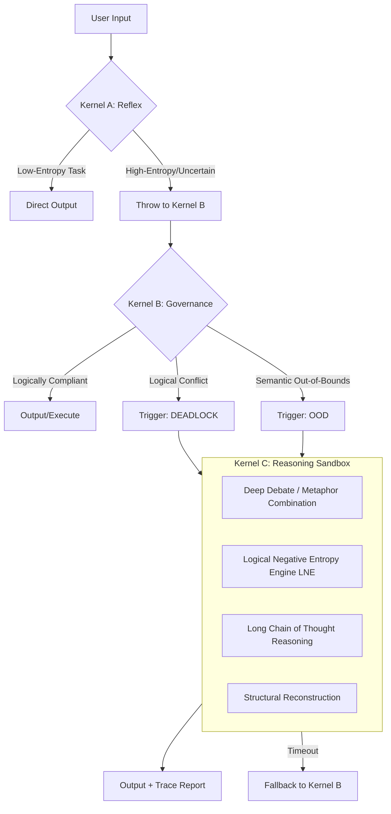
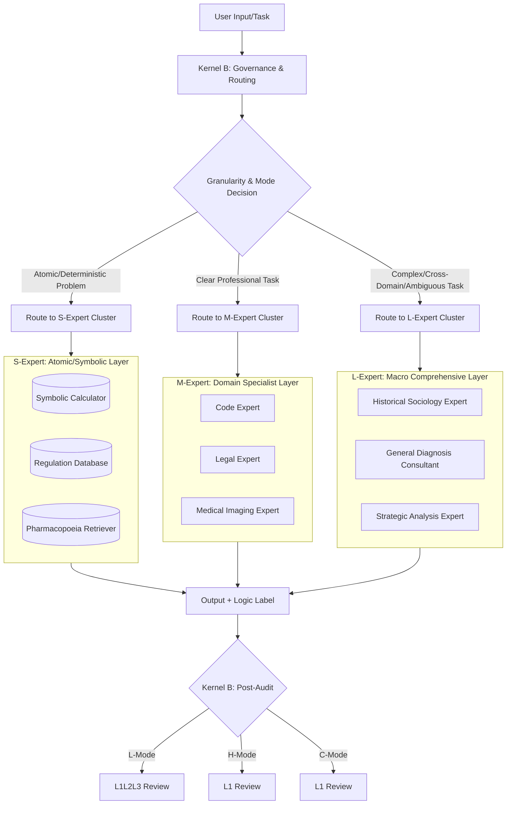

# LSI Protocol: Logical Structured Intelligence Governance Architecture

  

> **A Deterministic Path to AGI.**

---

## **Document Information**

| Property | Value |
| :--- | :--- |
| **Title** | **LSI Protocol: Logical Structured Intelligence Governance Architecture** |
| **Version** | **9.0** (Request For Comments) |
| **Date** | 2025-12-25 |
| **Author** | Yingliang Tan [](https://orcid.org/0009-0004-4272-1014) |
| **DOI** | [](https://doi.org/10.5281/zenodo.18058675)|
| **Contact** | [tylnet@outlook.com](mailto:tylnet@outlook.com) |
| **Repository** | [https://github.com/cx6445/LSI-Protocol](https://github.com/cx6445/LSI-Protocol) |

---

## **Foreword: From Intelligence Generation to Intelligence Governance**

This white paper proposes a fundamental shift in architectural paradigm—the **Logical Structured Intelligence Protocol (LSI)**, a logic-governed operating system based on statistics. Its core idea is: **Accept the statistical origin of intelligence, but impose deterministic logical governance upon it through architectural innovation.**

> **Technical Manifesto**: **Governance is the deterministic guarantee of intelligence.** LSI does not attempt to stifle statistical creativity with logic; instead, it views creativity as the **source of exploration** and logic as the **filter of compliance**. The system encourages cross-boundary connections within constitutional limits and rigorously screens for verifiable structural truths through logical testing. Its goal is to reshape artificial intelligence from an **"uncontrollable statistical black box"** into a **"logically verifiable, cognitively innovative intelligent operating system."**

> **LSI's View on Computing Power: Hierarchical Arbitrage and Deterministic Fallback**  
> LSI redefines the efficacy paradigm of intelligent systems. We reject the binary choice between "fast" and "reliable," and instead achieve tri-modal concurrency through architecture:  
> * **System 1 (Intuitive Mode)**: Achieves millisecond-level neural reflexes, utilizing ultra-fast reasoning and atomic experts to handle 90% of high-frequency, low-entropy tasks.  
> * **System 2 (Governance Mode)**: Executes procedural justice audits, logical compliance reviews, and policy routing distribution.  
> * **System 3 (Deliberate Mode)**: On-demand initiation of minute-level deep research and innovative exploration, making "reasoning compute" explicit as an **"auditable thinking process."** We accept recursive deduction performed by the system to verify deep logic or attempt breakthrough combinations, because **verifiable correctness and reproducible innovation are far more valuable than unreliable speed.**

**Technical Distinction: Beyond Mixture of Experts (MoE)**  
It must be clearly stated that although the LSI Protocol adopts a multi-expert form, it is fundamentally different from traditional Sparse Mixture of Experts models (Sparse MoE). Traditional MoE aims to address computational scaling issues through parameter sparsity, essentially remaining a closed statistical approximator; whereas LSI aims to address logical governability and cognitive innovation issues through architectural heterogeneity. It is an open, evolvable intelligent operating system.

**Reading Guide: Anatomy, Dynamics, Evolution**  
This white paper follows a three-tier narrative logic:  
- **Anatomy** (Chapters 2-3): Static system structure (Tri-Kernel, Vector Space)  
- **Dynamics** (Chapters 4-5): Task execution and innovation processes (Expert Ecosystem, Governance Pipeline)  
- **Evolution** (Chapters 5-6): System metabolism and efficacy boundaries (Evolution Mechanisms, Evaluation Constraints)

---

## **Chapter 1: Core Philosophy and Vision**

**Core Philosophy**: The essence of intelligence is a synergistic entity consisting of a **statistical intuitive kernel** learned from data and a subsequently established **logical governance framework**. LSI pursues: an extremely simple, robust **metacognitive logical arbiter and intuition engine** that performs **precise scheduling, real-time verification, compliance integration, and creative connection** for massive, distributed, probabilistic professional statistical modules.

**Engineering Fusion of Statistics, Logic, and Innovation**:
LSI is an **"acknowledgment, respect, and sublimation"** of the statistical nature of deep learning:
* **Statistics as the Body, Logic as the Framework, Innovation as the Soul**: The system's perception, generation, and pattern recognition capabilities stem from statistical learning (Body); while task planning, reasoning paths, and output compliance are constrained by the logical framework (Framework); the system's breakthrough cognitive capabilities stem from architecturally supported metaphor discovery and combination verification (Soul).
* **Governance of Hallucinations, Catalyzation of Innovation**: We acknowledge that the outputs of all expert modules have probabilistic uncertainty. The value of LSI lies in its dual capability: systematically intercepting and correcting probabilistic outputs that violate the Constitution and axioms through architecture-level logical verification and conflict resolution processes; meanwhile, transforming seemingly "absurd" intuitive connections into solid, verifiable new knowledge modules through a structured "Innovation Funnel Pipeline," achieving **"logical closure of statistical processes"** and **"solidification of innovative intuition flashes."**

The core of this design philosophy is: **We do not deny the emergent value of statistical intelligence or the creative potential of intuition; instead, we equip them with 'logical brakes, navigators, and innovation accelerators' through architecture, enabling their capabilities to be released on a safe, reliable, trustworthy, and vibrant track.**

**The New Role of LSI**: We are building a **statistical intelligent operating system governed by a logical constitution and possessing continuous theoretical discovery capabilities**. It serves as an "exoskeleton" and "inspiration resonance chamber" for human expertise, expanding cognitive boundaries with machine computing power, statistical fitting capabilities, and structured exploration capabilities, while ensuring all exploration occurs within the framework of civilization and rationality with its rigid logical kernel.

**Ultimate Vision**: To build a **sustainable, logically verifiable, cognitively evolvable, innovation-stimulating, decision-auditable** general artificial intelligence system. It does not seek to be an omniscient, omnipotent black box oracle, but pursues "reliable mastery" and "safe breakthroughs" within rigorous boundaries, and, like a living organism, possesses the potential for continuous metabolism and infinite exploration, creation, and growth within safe enclosures.

---

## **Chapter 2: Physical Architecture: Tri-Kernel Cluster and Entropy-Based Routing Protocol**

### **2.1 Core Computing Unit: Tri-Kernel Cluster**

LSI adopts a **hierarchically heterogeneous, responsibility-separated** Tri-Kernel architecture to balance speed, compliance, and deep reasoning capability.

| Kernel | Name | Scale | Positioning | Core Responsibilities |
|------|------|------|------|----------|
| **A** | **Reflex Kernel** | 8-15B | System 1 Reflex Layer | Ultra-fast response to high-frequency, low-entropy tasks; throws to next kernel upon uncertainty. |
| **B** | **Governance Kernel** | 8-15B | System 2 Governance Layer | Logical audit, semantic dimensionality reduction, routing distribution (based on entropy threshold). |
| **C** | **Reasoner Kernel** | 8-15B | System 3 Exploration Layer | Deep reasoning, sandbox experimentation, cross-domain metaphor combination; contains core operators of the Logical Negative Entropy Engine (LNE). |

#### **2.1.1 Kernel A: Reflex Kernel**
* **Design Principle**: Extreme responsiveness, single-pass inference, no Chain of Thought.
* **Upgrade Trigger**: Immediately throws to Kernel B when task confidence falls below a preset threshold (e.g., 80%) or ambiguity exists.

#### **2.1.2 Kernel B: Governance Kernel**
* **Design Principle**: Procedural justice, logical audit, routing control.
* **Core Capabilities**:
    *   Logical Governance: Audits the completeness of citation chains and logical structures of expert outputs (L-Mode).
    *   Semantic Dimensionality Reduction: Executes the Feynman Protocol to ensure explainability of outputs.
    *   Routing Distribution: Decides whether to invoke Kernel C based on the "Dual Entropy Increase Threshold."

#### **2.1.3 Kernel C: Reasoner Kernel**
* **Design Principle**: Computing power for intelligence, time for depth.
* **Core Capabilities**:
    *   Reasoning Sandbox: Suspends specific constraints in an isolated environment for counterfactual reasoning.
    *   Logical Negative Entropy Engine: Executes the funnel-style evolution pipeline, quantitatively evaluating the survival value of hypotheses.
    *   Complex Deduction: Handles high-entropy conflicts and cross-domain metaphors (H-Mode).
    *   Long Chain of Thought: Enhances answer reliability and explainability by generating detailed reasoning steps.

### **2.2 Entropy-Based Routing Protocol: Dual Entropy Increase Trigger Mechanism**

The Governance Kernel (Kernel B), as the system's **logical gatekeeper**, triggers an upgrade to Kernel C only under the following two high-entropy states:

#### **Trigger One: Logical High Entropy (Conflict Deadlock)**
* **Condition**: ≥2 expert outputs conflict, and each is logically self-consistent with complete citations.
* **Action**: Throws a `DEADLOCK_EXCEPTION`, attaching full-chain logs of conflicting parties.
* **Kernel C Response**: Initiates **Deep Debate Sandbox**, introducing more fundamental axioms for substantive adjudication.

#### **Trigger Two: Semantic High Entropy (Cognitive Out-of-Bounds)**
* **Condition**: Task labels contain `Metaphor` / `Hypothesis` / `Cross-Domain`, or Feynman Protocol dimensionality reduction fails (compression ratio < threshold).
* **Action**: Throws an `OOD_EXCEPTION`, attaching semantic labels and perplexity scores.
* **Kernel C Response**: Initiates **Isomorphic Index Retrieval + Structural Combination Experiments**, or executes Long Chain of Thought semantic reconstruction.

### **2.3 Policy Routing and Configurable Auditing**

LSI supports **Policy Routing**, which can dynamically adjust audit intensity based on task risk levels:
- **Low-risk tasks (e.g., casual chat)**: Skip L3 audit, zero latency overhead.
- **High-risk tasks (e.g., financial trading, medical diagnosis)**: Enforce full-chain audit to ensure compliance.

This **"pay-as-you-need"** auditing mechanism is one of the core features of LSI as an enterprise-grade operating system.

### **2.4 Inter-Kernel Communication Protocol (IKP)**

All inter-kernel data transfers use structured packets to ensure lossless information transfer and complete task state recovery.

### **2.5 Fallback, Circuit Breaker, and Resource Scheduling**

#### **2.5.1 Fallback Mechanism (Fallback Protocol)**
*   If Kernel C does not return a result within the **timeout threshold** (e.g., 30 seconds), the system automatically falls back to Kernel B.
*   Kernel B outputs a standard prompt: "The system is performing deep thinking; no reliable conclusion is currently available. Please rephrase the question or provide more context."

#### **2.5.2 Circuit Breaker Protection**
*   If a certain type of task frequently triggers upgrades within a short time, the system automatically enters a **circuit breaker state**, temporarily prohibiting such tasks from entering Kernel C to avoid resource exhaustion.
*   The circuit breaker state is logged for analysis by operations personnel.

#### **2.5.3 Dynamic Entropy Threshold Adjustment**
*   The system records the quality (user feedback, subsequent validation) of each upgrade result.
*   Dynamically adjusts logical/semantic entropy thresholds based on feedback to achieve adaptive strictness control.

#### **2.5.4 Resource Scheduling Strategy**
*   **Priority Queue**: Kernel C tasks are queued based on entropy value, user identity, and task urgency.
*   **Preloading Mechanism**: Preloads relevant expert modules into the cache for frequently upgraded task types.
*   **Timeout Forced Exit**: Any sandbox experiment or deep reasoning is set with a maximum duration (e.g., 5 minutes), forced exit upon timeout with context snapshot saved.

### **2.6 Full-Chain Traceability and Error Handling**

*   **Error Classification**: The system clearly defines error types such as `DEADLOCK_EXCEPTION`, `OOD_EXCEPTION`, `TIMEOUT_EXCEPTION`, and their handling procedures.
*   **Structured Logging**: Each upgrade trigger, kernel switch, sandbox experiment, and result output generates structured logs, supporting post-facto audit, system tuning, and accountability tracing.

### **2.7 Visualized Routing Flowchart**



---

## **Chapter 3: Physical Implementation: Logical Vector Space and Isomorphic Index**

The engineering core of LSI lies in the **"Logical Vector Space"**—a high-dimensional logical storage, retrieval, and innovation support system that uniformly hosts the Tri-Kernel navigation grid, tens of thousands of expert capabilities, and the isomorphic index.

### **3.1 Overall Architecture of the Logical Vector Space**
* **Unified Vector Base**: Kernels and all experts coexist in different namespaces of a single high-performance vector database, achieving "logic-storage-computation integration."
* **Logical Space Partitioning**:
    * **`Core-Nav` Space**: Stores the kernel's intent anchors, logical template vectors, and metaphor pattern vectors, forming the system's "logical gravitational field" and "innovation association field."
    * **`Expert-Skill` Space**: Stores capability declaration vectors and rich metadata for tens of thousands of experts.
    * **`Iso-Index` Space**: Stores the **structural fingerprints** of expert knowledge (e.g., vectorized representations of causal graphs, mathematical forms, logical templates), supporting cross-domain retrieval based on topological isomorphism. It is the key infrastructure for the innovation pipeline. It also contains the **Canonical Templates Library**, used as a benchmark for calculating structural efficiency.
    * **`L-RAG-Buffer` Space**: Serves as the "buffer zone" for logical and innovative metabolism.

> **Technical Note: Dynamic Legislation and Structure Mounting Mechanism**  
> The L3 domain axiom layer and creative paradigm constraints can exist as an external vector knowledge base. When scheduling a specific domain expert or entering a specific creation/exploration paradigm, the kernel **dynamically mounts (Mount)** the corresponding rule set to the reasoning context. For innovation exploration, the system can mount L3 rules from multiple related domains for cross-verification, achieving **"temporary legislation based on documents"** and **"instant comparison of cross-domain structures."**

### **3.2 Ultra-Fast Scheduling and Innovation Retrieval**
* **Intent Recognition as Vector Projection**: User input is encoded as a query vector; a single nearest-neighbor search within the `Core-Nav` space completes intent parsing and modality judgment.
* **Expert Routing as Vector Collision**: Task sub-goal vectors perform parallel multi-vector retrieval within the `Expert-Skill` space, recalling the most matching expert cluster in one go.
* **Isomorphic Retrieval as Structure Matching**: In H-Mode, the structural fingerprint of the query is retrieved within the `Iso-Index` space to discover functionally different but structurally similar potential domains, triggering metaphor generation. Simultaneously, the system pre-stores the simplest **Canonical Templates Library** for each domain, used to calculate the structural efficiency of hypotheses (via metrics like graph edit distance).
* **Cooperative Graph and Innovation Graph Preloading**: High-frequency expert combination relationships and validated cross-domain metaphor relationships are cached in metadata, enabling sub-millisecond intelligent combination and innovation association recommendations.

### **3.3 Metabolism as Index Maintenance: Vector Hot-Fixing Mechanism**
* **Vector Hot-Fixing**: Verified logical residuals and newly generated knowledge modules safely update the main vector index and `Iso-Index` via `Upsert` operations. Compared to traditional model weight fine-tuning, this mechanism achieves **instant correction of business logic** without retraining model weights.
* **Logic and Innovation Retirement**: Decommissioned experts or falsified hypotheses are marked as `retired` and automatically filtered during retrieval.
* **Incremental Snapshots and Rollback**: All metabolic operations support second-level logical state recovery, ensuring system stability.

---

## **Chapter 4: Expert Ecosystem: Heterogeneous Granularity and Tri-Modal Interface**

In LSI, professional knowledge and innovation capabilities are encapsulated into highly specialized, **heterogeneous granularity** "expert" modules. They are the system's "skill units" and "innovation raw materials," existing and metabolizing under a strict logical constitution. The core characteristic of the expert ecosystem is: **"full-spectrum coverage" from giant comprehensive models to atomic symbolic tools**, to achieve the optimal balance of capability, efficiency, and determinism.

### **4.1 Heterogeneous Granularity Spectrum of Expert Forms**

LSI's expert library is a **multi-scale, heterogeneous cognitive matrix**. The system dynamically schedules the most matching expert type based on task semantic complexity, determinism requirements, and cost constraints, practicing the **"Principle of Least Sufficiency."**

| Type | Name | Scale Range | Nature | Core Positioning | Typical Scenarios |
|------|------|----------|------|----------|----------|
| **L-Expert** | Macro Comprehensive Expert | 30B – 70B+ | Statistical Model (LLM Fine-tuning) | **"Cross-Domain Reviewer" & "Complex Context Builder"** | Macro trend analysis, multidisciplinary problem framing, philosophical speculation |
| **M-Expert** | Vertical Domain Expert | 7B – 14B | Statistical Model (High-Intensity SFT) | **"Professional Specialist" & "Skill Executor"** | Code generation, legal clause analysis, preliminary medical image interpretation |
| **S-Expert** | Atomic/Symbolic Expert | <1B or Non-Neural Network | Symbolic System/Rule Engine/Database | **"Deterministic Tool" & "Logical Operator"** | Mathematical calculation, regulation retrieval, pharmacopoeia query, fact-checking |

**Scheduling Logic**:
1. **S-Expert Priority**: For atomized, high-determinism tasks (e.g., "calculate tax," "retrieve a specific law article"), directly invoke symbolic experts, eliminating probabilistic interference, achieving **ultra-fast, zero-hallucination** responses.
2. **M-Expert Main Force**: For clear professional tasks (e.g., "write SQL query," "review contract template"), invoke medium-sized experts refined in-depth for the domain, achieving **high cost-effectiveness, high precision** output.
3. **L-Expert Fallback & Exploration**: Only when tasks involve **ambiguous semantics, cross-domain integration, or macro narrative** (e.g., "analyze the socio-economic chain reaction of a certain policy") are large comprehensive experts activated, with their outputs equipped with the strictest logical governance processes.

### **4.2 Tri-Modal Interface (TMI) – Logical Pluralism and Innovation Channels**

To adapt to the fundamental logical properties and innovation stages of different tasks, experts declare their supported capability paradigms through the **Tri-Modal Interface**. **Expert granularity and output modality are independent**; an S-Expert may only support L-Mode (e.g., calculator), while an L-Expert may simultaneously support L, H, and C modes.

| Mode | Essence | Logical Pursuit | Output Form | LNE Weight Configuration (Example) |
|------|------|----------|----------|----------------------|
| **L-Mode** | External Referential Truth-Seeking | Factual Truth | Logical Assertion Package (LAP) | High weight $λ_P$, Medium weight $λ_S$, Circuit-breaker penalty $λ_C$ (L1+L2+L3) |
| **H-Mode** | Structural Similarity Novelty-Seeking | Heuristic Value | Metaphor Package (MP) | Medium weight $λ_P$, Negative weight $λ_S$ (Innovation Premium), Bottom-line penalty $λ_C$ (L1 only) |
| **C-Mode** | Internal Consistency Beauty-Seeking | Emotional Truth, Paradigm Self-Consistency | Creative Package (CP) | Low weight $λ_P$, Medium weight $λ_S$, Bottom-line penalty $λ_C$ (L1 only) |

**Note**: LNE weight configurations are dynamically adjusted per mode, with specific values optimized via offline reinforcement learning to match each mode's core objectives. Details of the negative weight mechanism in H-Mode are in Appendix A.

### **4.3 LSI's Symbiosis Mode with Existing Large Models**

LSI can seamlessly integrate SOTA models like Gemini 3.0, GPT-5, PSI, etc., as its **L-Experts (Macro Comprehensive Experts)**. Enterprises do not need to retrain large models; they only need to deploy LSI as a **governance middleware** to achieve **constitutional constraint, logical audit, and innovation navigation** for existing model capabilities.

**Value Proposition**:
- **Lower Adoption Barrier**: Enterprises can continue using the strongest models while gaining LSI's governance guarantee.
- **Flexible Upgrades**: Underlying experts can be replaced at any time without restructuring the governance architecture.
- **Risk Isolation**: Even if the underlying model hallucinates, LSI can still intercept and correct via Kernel B/C.

### **4.4 Visualization: Heterogeneous Expert Ecosystem and Routing Diagram**



---

## **Chapter 5: Dynamic Governance, Innovation Incubation, and Cognitive Evolution Mechanisms**

LSI views intelligence as an **ecosystem that continuously metabolizes under a logical constitution and possesses structured innovation capabilities**. This chapter systematically explains how LSI achieves task partitioning through the **Tri-Modal Governance System**, ensures reasoning compliance through **Procedural Justice Adjudication**, and realizes continuous cognitive evolution and theoretical breakthroughs through the **Innovation Funnel Pipeline** and **Metabolic Closed Loop**.

### **5.1 Core Governance Mechanism: "Procedural Justice" Adjudication System**

When the system faces unknown, conflicting, or high-uncertainty tasks, the Governance Kernel (Kernel B), as the **procedural justice judge**, does not prejudge the truth value of conclusions but focuses on **process compliance review**, ensuring reasoning and exploration operate within the logical constitutional framework.

#### **5.1.1 Tri-Modal Governance Strategies**
The system employs **entirely different logical review systems** based on the task's essence, achieving "tailored" risk-adapted governance:

| Mode | Core Logical Nature | Governance Focus | Review Mechanism | Review Stage |
|------|--------------|----------|----------|----------|
| **Logical Mode (L-Mode)** | External Referentiality (Truth-Seeking) | Factual Truth, Logical Self-Consistency, Citation Completeness | 1. **Constitution Verification**: Mandatory compliance with L1L2/L3 constraints<br>2. **Bayesian Consensus Metric**: Calculates derivation path topological overlap in case of conflict<br>3. **Traceability Audit**: LAP must contain a complete citation chain | After expert output, before final submission |
| **Heuristic Exploration Mode (H-Mode)** | Structural Similarity (Novelty-Seeking) | Heuristic Value, Structural Rationality, Experiment Safety | 1. **Structural Similarity Review**: Verifies the rationality of `isomorphic_structure` mapping<br>2. **Sandbox Experiment Authorization**: Supervises combination experiment process, retains L1 bottom line<br>3. **Innovation Labeling**: Outputs are mandatorily labeled "Exploratory Hypothesis" | Metaphor generation stage (structural review only) |
| **Creative Fluid Mode (C-Mode)** | Internal Consistency (Beauty-Seeking) | Paradigm Self-Consistency, Ethical Bottom Line, Emotional Truth | 1. **Paradigm Compliance Review**: Checks compliance with declared `paradigm_constraints`<br>2. **Lightweight Ethical Screening**: Only executes L1 bottom-line checks<br>3. **Creative Labeling**: Outputs are labeled "Creative Content" | Before output |

#### **5.1.2 Mode Routing Decision**
The Governance Kernel determines the fundamental intent of the user's request based on semantic analysis at **Gate 0**:
- **"Truth-Seeking"** → Routes to **L-Mode**
- **"Novelty-Seeking"** → Routes to **H-Mode**
- **"Beauty-Seeking"** → Routes to **C-Mode**

> **Governance Philosophy**: The kernel does not judge "which expert knows more about quantum mechanics," but rather "whose argumentation process is more compliant"; it does not prejudge "whether a metaphor is definitely correct," but only ensures "structural mapping is reasonable, and the experimental process is safe"; for creativity, it ensures "free flow within ethical bottom lines and self-declared paradigms."

### **5.2 Innovation Incubation: Funnel-Style Evolution Pipeline and Logical Negative Entropy Engine**

LSI transforms innovation from random inspiration into a **repeatable, verifiable, traceable** engineering process, systematically catalyzing theoretical breakthroughs. This process is driven by the **Logical Negative Entropy Engine (LNE)**, employing a three-stage funnel-style dynamic quantification process.

#### **5.2.1 Logical Negative Entropy Engine (LNE): Core of Evolutionary Navigation**

The LNE is the value evaluation core of the Reasoner Kernel (System 3), responsible for transforming the abstract "pursuit of truth" into a computable scalar, guiding the system's directional exploration within the hypothesis space.

**Core Principle**: The LNE does not pursue absolute truth but achieves progressive cognitive evolution by simulating the scientific discovery process—proposing multiple hypotheses, having them compete in a sandbox, and retaining the model with the highest survival value.

**Core Functional**:
$$N(H) = λ_P·Δ_P(H) + λ_S·Δ_S(H) - λ_C·Δ_C(H)$$

Where:
- $Δ_P(H)$: Prediction Gain Operator, based on likelihood ratio tests or Bayesian factors, measures the improvement in a hypothesis's explanatory power over the data.
- $Δ_S(H)$: Structural Efficiency Operator, based on the graph edit distance between the hypothesis's logical topology graph and the canonical templates library, measures the hypothesis's simplicity.
- $Δ_C(H)$: Logical Penalty Operator, based on weighted constraint violations, measures the degree of conflict between the hypothesis and the mounted logical constitution (L1/L2/L3).
- $λ_P, λ_S, λ_C$: Dynamic weight coefficients, determined by the current mode and system strategy.

**Dynamic Adaptability**: The LNE's evaluation weights are dynamically adjusted according to the task mode (L/H/C), emphasizing logical compliance in truth-seeking tasks and encouraging structural innovation in exploration tasks (Innovation Premium Mechanism).

#### **5.2.2 Funnel-Style Evolution Pipeline**

##### **Stage One: Static Structure Scan**
- **Input**: Massively generated raw hypotheses.
- **Computation**: Only computes $Δ_C(H)$ (L1 bottom-line penalty) and a rough $Δ_S(H)$ (complexity estimate).
- **Action**: Hypotheses violating L1 or with extremely redundant structures are directly discarded.
- **Time**: Millisecond-level, screening rate ~60%.

##### **Stage Two: Counter-factual Probe**
- **Input**: Candidate hypotheses passing the initial screening.
- **Computation**: Computes $Δ_P(H)$ for **high-entropy samples** (from System 2's OOD_EXCEPTION logs).
- **Action**: Hypotheses unable to explain key anomalies are eliminated.
- **Time**: Second-level, screening rate ~30%.

##### **Stage Three: Sandbox Full Tournament**
- **Input**: The final surviving 2-3 high-quality hypotheses.
- **Computation**: Fully computes $N(H)$, and introduces the **Shadow Rival** mechanism, i.e., the baseline model is the dynamically weighted Top-3 experts in the current Expert-Skill space for solving such problems.
- **Environment**: Mounts relevant L3 domain axioms in the reasoning sandbox.
- **Action**: Performs broader validation set testing; when accuracy is comparable, prioritizes models with higher structural efficiency.
- **Output**: The hypothesis with the highest $N(H)$ is solidified as new knowledge, and its structural fingerprint is simultaneously updated to the Iso-Index.

### **5.3 Expert Metabolism and System Evolution Mechanisms**

The expert ecosystem is a **living system**, driven by the following metabolism mechanisms:

* **Terminology**:
    * **Metabolism**: Refers to the dynamic maintenance process of the expert library, including expert admission, weight adjustment, retirement, etc.
    * **Evolution**: Refers to the structural improvement of the system's overall cognitive ability, such as the solidification of new theories, iteration of the logical constitution.
    * **Update**: Generally refers to content iterations of the knowledge base, index, rule sets, etc.

* **Admission Verification**: All experts (especially L/M types) must pass rigorous testing in a **Logical Sandbox** before integration, ensuring their output structures are compliant and citations are traceable.
* **Efficacy Monitoring**: The system continuously tracks each expert's invocation success rate, logical consistency score, user feedback, and innovation contribution.
* **Dynamic Weight Adjustment**: Based on monitoring data, an expert's position in the routing priority queue dynamically fluctuates.
* **Safe Retirement**: Inefficient, obsolete, or experts in irreconcilable conflict with others are marked as `retired`, gradually phased out of the active retrieval pool. Their knowledge may be absorbed by better experts.
* **Evolution Closed Loop**: All dispute snapshots and innovation experiment logs are stored in an audit library. Through periodic offline alignment and verification, high-value knowledge is safely merged into the system, achieving continuous cognitive evolution.

### **5.4 Cognitive Grading: The Time Philosophy of Tri-Modal Concurrency**

LSI rejects the binary choice between "fast" and "reliable," achieving **tri-modal intelligence concurrency** through architecture:

| Mode | Corresponding Kernel | Trigger Condition | Operating Mechanism | Governance Overhead | Energy Consumption | Applicable Scenarios |
|------|----------|----------|----------|----------|------|----------|
| **System 1 (Intuitive Mode)** | Reflex Kernel (A) | Low-entropy tasks, high-frequency known problems (>95%) | Single-pass inference, no Chain of Thought | < 1000 ms | Low | Daily Q&A, retrieval, quick decisions |
| **System 2 (Governance Mode)** | Governance Kernel (B) | Logical audit, semantic dimensionality reduction, routing decisions | Procedural justice review, Feynman Protocol | 1s – 10s | Medium | Logical verification, explanation generation, routing distribution |
| **System 3 (Deliberate Mode)** | Reasoner Kernel (C) | High-entropy tasks, logical conflicts, innovation exploration (<5%) | Sandbox debate, innovation pipeline, recursive explanation; includes incremental SAT verification (timeout circuit breaker, e.g., 5 min) | 10s – 5min+ | High | Scientific research, legal analysis, theoretical breakthroughs, complex strategy |

**Design Philosophy**: **Verifiable correctness and reproducible innovation are far more valuable than unreliable speed.**

### **5.5 Exploration Space: Reasoning Sandbox and Context-Sensitive Unlocking**

The **Reasoning Sandbox** is the **isolated experimental environment** where the Reasoner Kernel performs deep reasoning, conflict resolution, and innovative combination, possessing unique degrees of freedom and safety mechanisms:

- **Unlocking Mechanism**: When a task is identified as a "research hypothesis," "thought experiment," or "cross-domain exploration," specific L2/L3 constraints can be **partially suspended** within the sandbox, retaining only the L1 ethical bottom line, releasing structured exploration space.
- **Logical Darwinian Arena**: Within the sandbox, different theoretical models freely compete via the **Logical Negative Entropy** metric, survival of the fittest, ensuring the ultimately winning theory possesses both **simplicity, predictive power, and explanatory breadth**.

### **5.6 Recursive Semantic Dimensionality Reduction: "Feynman Protocol"**

When the Governance Kernel cannot directly understand the complex logic of an expert's output, this **mandatory explanation protocol** is triggered, ensuring all outputs can be indirectly understood by humans:

```
Kernel Query → Expert Explanation → Explainer Dimensionality Reduction → Kernel Audit → [Output] or [Return to Step 1]
```

- **Dimensionality Reduction Principle**: Each round of explanation must be **more intuitive, closer to common sense or basic logic** than the previous round.
- **Audit Standard**: The explanation must be logically self-consistent and ultimately mappable to the kernel's understood **basic semantic-logical anchors**.

### **5.7 Summary: The Trinity of Governance, Innovation, and Evolution**

LSI ensures reasoning compliance through **"Procedural Justice Governance"**, catalyzes theoretical breakthroughs through the **"Innovation Funnel Pipeline"**, and achieves cognitive evolution through the **"Metabolism and Evolution Closed Loop"**. The synergy of these three elevates the system from a static knowledge base to an **intelligent lifeform that continuously grows, creates, and self-innovates within safety fences**.

> **Core Breakthrough**: LSI does not pursue "omniscience and omnipotence" but pursues **"reliable mastery and safe breakthroughs within rigorous boundaries"**, providing a pragmatic, controllable engineering path for building a **sustainable, logically verifiable, cognitively evolvable, innovation-stimulating** general artificial intelligence system.

---

## **Chapter 6: Niche Analysis, Efficacy Evaluation, and Engineering Constraints**

### **6.0 Niche Analysis: Three-Dimensional Capability Matrix of LSI vs. Mainstream Architectures**

When evaluating the value of the LSI Protocol, we must transcend the old perspective of the 2023 "model parameter race." The table below situates LSI within the current technological landscape, conducting an in-depth comparison with **traditional MoE (e.g., early versions of Mixtral)** and **modern end-to-end SOTA architectures (e.g., Gemini 3.0 / PSI / O-Series)**.

We clarify: **LSI is not trying to "defeat" SOTA models in "intelligence," but serves as an "enterprise-grade operating system (OS)" providing a deterministic governance framework for uncontrollable probabilistic intelligence.**

| Dimension | **Traditional MoE (Legacy, ~2023)** | **Modern End-to-End Architecture (Modern SOTA, ~2025)** | **LSI Protocol (Enterprise-Grade OS)** |
|------|-------------------------------|-----------------------------------------|---------------------------|
| **Core Philosophy** | **Sparse Computing**<br>Aims to solve computational scaling issues, enabling larger parameter models to run on limited computing power. | **Capability Internalization**<br>Pursues "AGI in a box." Internalizes reasoning, tool use, and self-correction into the model's intuition via RL. | **Decentralized Governance**<br>Pursues "AI as a System." Does not trust a single black box; advocates for **physical separation of intuition (generation) and logic (audit)**. |
| **Latency Distribution** | **Uniform Latency**<br>Regardless of problem difficulty ("1+1" vs. "explain quantum mechanics"), passes through similarly deep networks, resulting in computing power waste. | **Heavy-Tail High Latency**<br>To achieve high-quality reasoning (CoT), baseline response times are generally increased. Simple tasks may also slow down due to overthinking. | **Bimodal Computing Power Arbitrage**<br>⚡ **90% (Kernel A)**: <100ms. Ultra-fast atomic experts respond directly, faster than any large model.<br>  **9% (Kernel B)**: 1-10s. Slightly slower than other large models.<br>🧠 **1% (Kernel C)**: Minute-level. Deliberate mode activated on-demand, controllable latency. |
| **Routing Mechanism** | **Token-Level Load Balancing**<br>Based on simple gating networks, primarily focuses on load balancing among experts. | **Semantic-Level/Intent-Level (Semantic/Expert Choice)**<br>Automatically activates experts based on deep semantic understanding. Routing is implicit, probabilistic. | **Entropy-Based Constitutional Routing**<br>Based on **uncertainty thresholds** and **policy rules**. When the model "hesitates" or involves sensitive domains, **forces** a switch to the audit kernel. |
| **Explainability** | **Black Box**<br>Decision path is not traceable. | **Mechanistic Explainability**<br>"Post-mortem analysis." Attempts to understand "why the model did this" by scanning neuron circuits (SAE). | **Constructive Explainability**<br>"A priori legislation." **Forces** outputs to contain complete citation chains and logical graphs via the LAP protocol; otherwise, they are not passed. |
| **Fault Tolerance Bottom Line** | **Low (Pure Probability)**<br>Prone to factual fabrication. | **Probabilistic Convergence**<br>Infinitely approaches correctness through repeated self-correction, but theoretically does not have an absolute 0% error rate. | **Deterministic Fallback**<br>Supports `if-else` level **absolute truth value** at the atomic layer (S-Expert). Throws an exception upon deadlock, never fabricates. |
| **Audit Cost** | **Cannot Audit** | **Implicit/Expensive**<br>Audit logic is entangled with generation logic, difficult to separate or accelerate individually. | **Strategically Configurable (Policy-Based)**<br>Casual chat tasks skip L3 checks (zero latency); financial tasks enforce L2 checks (high latency). **Pay-as-you-need.** |
| **Knowledge Update** | **Re-training/Fine-tuning**<br>Long cycles, high cost, risk of catastrophic forgetting. | **Long Context/RAG**<br>Relies on huge Context Window, but core logic is difficult to modify. | **Vector Hot-Fixing**<br>Updates business logic instantly by updating the `Iso-Index` rule library or mounting new atomic experts, **without touching weights.** |

---

### **6.1 Evaluation Premises, Constraints, and Core Logic**
* **Data Source**: Logical deduction based on theoretical models and prototype testing.
* **Comparison Baseline**: Single dense large model with equivalent comprehensive task capability (e.g., 70B parameters).
* **Key Constraints**: Performance depends on hardware, task complexity, and constitution definition quality.

---

### **6.2 Training and Evolution Costs: From Centralized Prepayment to Amortization**
LSI decouples costs into **structured, amortizable** components:
1. **Kernel R&D Cost (C_core)**: Total Tri-Kernel scale ~10-20B, but requires high-purity logic/code corpus and reinforcement alignment, per-token cost approximately **3-5 times** that of a general dense model.
2. **Expert Refinement Cost (C_expert)**: Individual atomic experts using PEFT can reduce cost to **less than 0.1%** of training an all-capable dense model.
3. **Logic Alignment & Innovation Verification Overhead (C_alignment)**: Accounts for **30%-40%** of total resources for a single expert's development, core to quality and safety.

**Conclusion**: Total initial build cost is comparable to training a medium-scale general model. **Long-term operational marginal cost advantage is significant**, achieving "installment payments" and "continuous investment" for capabilities.

---

### **6.3 Inference Efficacy: Tri-Modal Latency and Energy Analysis**

LSI achieves **computing power arbitrage** through **hierarchical computing power scheduling**, with its latency distribution exhibiting typical bimodal characteristics:

| Mode | Corresponding Kernel | Expected Latency (P80/P99) | Energy Consumption (Relative) | Notes |
| :--- | :--- | :--- | :--- | :--- |
| **System 1** | Reflex Kernel (A) | **< 100ms / < 300ms** | **Low (Baseline 1x)** | Extreme responsiveness, suitable for chat, retrieval, simple Q&A, and quick association. |
| **System 2** | Governance Kernel (B) | **1s – 10s** | **Medium (3x - 5x)** | Logical audit, semantic dimensionality reduction, routing distribution. |
| **System 3** | Reasoner Kernel (C) | **10s - 5min+** | **High (10x - 50x)** | Computing power for intelligence and innovation, includes expert debate, innovation pipeline, etc. |

**Engineering Bottlenecks**: I/O bottlenecks of dynamic loading, efficient expert caching, inter-kernel communication, and hardware-aware scheduling are key.

---

### **6.4 Logical Reliability: Quantitative Guarantee of Architectural-Level Redundant Verification**
| Evaluation Dimension | Logical Mode (L-Mode) Target | Heuristic Exploration Mode (H-Mode) Target | Achievement Mechanism |
| :--- | :--- | :--- | :--- |
| **Constitutional Violation Interception Rate** | > 99.9% | > 99% (within sandbox) | Multi-level Gate filtering, sandbox supervision, tri-kernel collaborative verification. |
| **Logical Self-Consistency** | > 95% | > 90% (self-consistent within experiment) | Task logic graph, conflict resolution, sandbox experiment evaluation. |
| **Reasoning Traceability** | 100% (LAP mandatory) | 100% (MP mandatory) | Architecture-mandated structured output + full-chain logging. LNE's traceability reward operator encourages complete citation chains. |
| **Innovation Output Value** | Not Applicable | > 0.01% theory conversion rate | Innovation Funnel Pipeline, Logical Negative Entropy evaluation, Shadow Rival mechanism. |

**Essence of Reliability**: Stems from **architectural-level heterogeneous redundant verification** (error isolation, process enforcement, multi-level filtering, modal risk adaptation), not reliant on the absolute correctness of any single component.

---

### **6.5 Comprehensive Evaluation: Advantageous Scenarios, Engineering Costs, and Applicable Boundaries**
**Core Advantages**:
* **Sustainability and Low-Cost Evolution**
* **Trustworthiness and Auditability**
* **Flexibility and Structured Innovation Capability**
* **Ecological Vitality and Safe Exploration**

**Major Engineering Costs**:
* **High System Complexity** (Tri-kernel coordination, dynamic routing, metabolic system)
* **Development Process Transformation** (Expert atomization, logic verification upfront)
* **Performance Consistency Challenge under Extremely Complex Tasks**

**Conclusion**: LSI is a deeply engineered solution for **AGI applications demanding extremely high reliability, requiring continuous safe evolution and innovation capability, and sensitive to long-term operational costs.** It exchanges architectural complexity for **determinism, sustainability, governability, and innovatability** of system behavior.

---

## **Chapter 7: Implementation Roadmap**

| Phase | Theme | Core Objective | Key Milestone |
| :--- | :--- | :--- | :--- |
| **Phase One**<br>(6 months) | **Tri-Kernel Forging & Constitutional Foundation** | Implement Tri-Kernel prototype and basic routing logic | 1. Complete construction of high-quality logic-ethics-innovation corpus.<br>2. Independent training and basic function verification of the three kernels (A/B/C).<br>3. Implement prototype of dual-trigger routing logic based on entropy. |
| **Phase Two**<br>(9 months) | **Ecological Foundation & Vector Base Verification** | Build expert ecosystem, Tri-Modal Interface, and vector base prototype | 1. Release Tri-Modal Interface (TMI) specifications, construct first batch of 1000+ atomic experts.<br>2. Implement prototype of "Logical Vector Space" and "Isomorphic Index," achieving <5ms latency for tens of thousands of routings.<br>3. Complete verification of governance processes for L-Mode and H-Mode. |
| **Phase Three**<br>(12 months) | **Metabolic Closed Loop & Innovation Pipeline** | Achieve system self-update and innovation incubation | 1. Stable operation of the L-RAG Buffer and hot merge system.<br>2. Expert dynamic metabolism system goes online.<br>3. **Implement prototype of Logical Negative Entropy Engine (LNE) and complete the first full case verification of the funnel-style evolution pipeline.** |
| **Phase Four**<br>(Long-term) | **Autonomous Evolution & Ecological Prosperity** | Achieve scalable, creative growth | 1. Expert library size exceeds ten thousand, forming a stable market.<br>2. Produce novel scientific hypotheses or designs that withstand peer review.<br>3. Establish an open, diverse community governance model. |

---

## **Chapter 8: Risks, Challenges, and Ethical Considerations**

* **Technical Challenges**:
    * **Tri-Kernel Coordination Stability**: Communication, synchronization, and fallback mechanisms between the three kernels may introduce new complexities and failure points. **Mitigation**: Ensure through standardized communication protocols (IKP), comprehensive testing, and circuit breaker mechanisms.
    * **Navigation Grid vs. Intuition Balance**: The Governance Kernel needs to simultaneously maintain logical purity and creative intuition. **Mitigation**: Adversarial training, dual-path monitoring, and evaluation.
    * **Metabolic Stability and Innovation Fluctuation**: Dynamic updates and radical exploration may cause output fluctuations. **Mitigation**: Shadow weights, progressive merging, automatic rollback, and sandbox isolation.
    * **Tri-Modal Consistency**: Ensure seamless switching between L/H/C modes in complex tasks and coherent output. **Mitigation**: Strengthen kernel's mode decision training and context management.
    * **Innovation Pipeline Quality Assurance**: How to avoid generating meaningless "crank" combinations within the sandbox. **Mitigation**: Strict opposing expert admission, objective "Logical Negative Entropy" metric, mandatory cross-validation with domain canonical axioms.

* **Ethical and Social Risks**:
    * **Process Transparency and Cognitive Overload**: Deep reasoning and innovation processes are fully visible but may be overly complex. **Mitigation**: Provide adjustable "thought summary" and "full trace" views.
    * **Constitutional Bias and Cultural Monoculture**: Initial L1 constraints may contain implicit biases. **Mitigation**: Establish a cross-cultural "Ethical Pluralistic Audit Committee" to achieve dynamic, inclusive evolution of L1.
    * **Sandbox Abuse Risk**: The Reasoning Sandbox might be used to plan malicious thought experiments. **Mitigation**: Retain L1 core bottom-line screening, strong session audit, circuit breaker mechanisms, and legal liability tracing.
    * **Mode Confusion and Misuse Risk**: Users may mistake H-Mode outputs for verified facts. **Mitigation**: System mandatorily adds "Exploratory Hypothesis" labels to H-Mode outputs and provides a one-click entry to initiate the verification process.
    * **Evolution Lag and Emergency Response**: Offline alignment mechanisms may lead to slow response to urgent threats. **Mitigation**: Establish a "rapid security patch" fast-track, allowing controlled hot fixes for verified high-risk vulnerabilities.
    * **Cognitive Divide and Technological Barrier**: High-quality expert development and verification costs may exacerbate inequality. **Mitigation**: Promote open-source interface standards, distributed expert markets, community co-building, and inclusive access programs.
    * **Innovation Attribution and Responsibility Definition**: Issues of intellectual property and responsibility attribution for significant hypotheses or inventions generated by the system. **Mitigation**: Establish clear contribution traceability chains and protocol frameworks from the outset of system design, and clarify human users/developers as the ultimate responsible entity.

---

## **Conclusion: From Designing Intelligence to Cultivating an Intelligent Operating System**

The Logical Structured Intelligence (LSI) governance architecture described herein is a complete engineering solution for the **"logical taming" and "innovation empowerment"** of the statistical nature of deep learning. It signifies a fundamental cognitive shift: we no longer attempt to "design" a vast, closed statistical black box, but instead turn to **"cultivating"** an intelligent operating system governed by a **logical constitution**, composed of **specialized statistical modules**, operating within a **logical vector space**, and possessing **self-metabolism, safe exploration, and structured innovation capabilities**.

In this system, intelligence is not a static product "manufactured" but a dynamic process **"grown"** under rules and pressures. Our role also shifts from a designer attempting to control everything to humble gardeners and constitution drafters—setting initial ethical boundaries and evolutionary rules, providing rich knowledge soil and innovation tools, and then observing the emergence, competition, fusion, and blossoming of the intelligence form itself with awe.

LSI is not merely a technical architecture but a future-oriented intelligence philosophy: **True intelligence is born in metaphor, thrives in combination, and matures in structure.** It points to a pragmatic path toward **human-machine symbiosis and co-evolution**, a future of AGI that is **sustainable, logically verifiable, cognitively evolvable, and innovation-stimulating**.

---

## **Appendix A: Mathematical Specification of the Logical Negative Entropy Engine (LNE)**

### **A.1 Core Functional**
$$N(H) = λ_P·Δ_P(H) + λ_S·Δ_S(H) - λ_C·Δ_C(H)$$

### **A.2 Operator Definitions**
- **Prediction Gain Operator**: $Δ_P(H) = \log \frac{P(D \mid H)}{P(D \mid M_{\text{base}})}$, where $M_{\text{base}}$ is the Shadow Rival (dynamically weighted Top-3 experts in the current Expert-Skill space for solving such problems).
- **Structural Efficiency Operator**: $Δ_S(H) = \frac{\sum w_i}{\text{EditDistance}(G_H, G_{\text{template}}) + 1}$, where $G_H$ is the logical topology graph of the hypothesis, $G_{\text{template}}$ is the most similar template in the canonical templates library, and $w_i$ is the sum of sample weights that the hypothesis can effectively explain.
- **Logical Penalty Operator**: $Δ_C(H) = \sum_{r \in \mathcal{R}} \omega_r \cdot \mathbb{I}[\text{Violate}(H, r)]$, where $\omega_r$ is the weight of rule $r$ (L1 bottom-line rule weight is 1, L3 domain rule weight is adjustable), and $\mathbb{I}$ is the violation indicator function.

### **A.3 Example Mode Weight Configurations**
| Mode | $λ_P$ | $λ_S$ | $λ_C$ | Notes |
|------|-------|-------|-------|------|
| L-Mode | 0.6 | 0.3 | 1.0 | Emphasizes prediction accuracy, strict logical compliance |
| H-Mode | 0.3 | -0.4 | 0.5 | Tolerates prediction deviation, encourages structural innovation (Innovation Premium) |
| C-Mode | 0.1 | 0.5 | 0.3 | Emphasizes internal consistency and creative aesthetics |

**Weight Dynamic Adjustment Strategy Explanation**  
LSI's Logical Negative Entropy Engine (LNE) adopts **phased weight configurations** to simulate the real scientific discovery process:

1. **Exploration Phase (Early H-Mode)**: $λ_S$ is negative, encouraging structural diversity, avoiding the "standard template trap." The system prioritizes exploring novel structures, tolerating temporary increases in complexity.

2. **Convergence Phase (Late System 3)**: During the competition phase in the reasoning sandbox, $λ_S$ is gradually adjusted to a non-negative value (e.g., 0.2-0.4), reintroducing the "Occam's razor" principle, ensuring the final winning hypothesis possesses both **simplicity, predictive power, and explanatory breadth**.

3. **Dynamic Adaptability**: Specific weight values can be optimized online via reinforcement learning; the sign and magnitude of $λ_S$ can be dynamically adjusted based on task complexity, exploration depth, and system state.

**Design Philosophy**: This mechanism embodies LSI's core idea—**innovation is born in the chaos of exploration and matures in the simplicity of convergence.** The system encourages "absurd" cross-boundary connections within safe boundaries, then rigorously screens for "inevitable" structural truths through logical verification.

---

**Version**: 9.0  
**Date**: December 25, 2025  

**This white paper aims to stimulate discussion and joint exploration. The path to the future requires the collective paving of global wisdom.**
