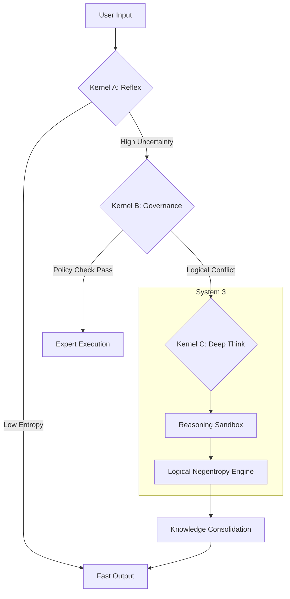

# LSI Protocol: Logical Structured Intelligence Governance Architecture

   

> **A Deterministic Path to AGI.**

---

## 📖 Access the Specification

**Current Version: v9.0 (RFC)**
Please select the link below to view the full whitepaper:

*  **English Version**: [LSI_Protocol_v9.0_EN.md](./LSI_Protocol_v9.0_EN.md)
*  **中文版**: [LSI_Protocol_v9.0_CN.md](./LSI_Protocol_v9.0_CN.md)

---

## 💡 Introduction

**LSI (Logical Structured Intelligence)** is an enterprise-grade operating system designed to provide a deterministic governance framework for modern statistical AI (LLMs).

Unlike traditional MoE (Mixture of Experts) which focuses on parameter efficiency, LSI focuses on **Logic Governance**. It introduces a rigid constitutional boundary to probabilistic outputs, ensuring reliability, explainability, and continuous evolution.

### Core Philosophy
*   **Statistical as Body, Logical as Law.**
*   **Governance is the prerequisite for Intelligence.**
*   **Collapse probability into structure.**

---

## 🧩 Key Architecture

The LSI Protocol is built upon the **Tri-Kernel Architecture**, separating intuition from reasoning:

| Kernel | System Mode | Role | Latency | Description |
| :--- | :--- | :--- | :--- | :--- |
| **Kernel A** | **System 1** (Reflex) | **Speed** | <100ms | Handles 90% of high-frequency tasks. Instant response, no reasoning chain. |
| **Kernel B** | **System 2** (Governance) | **Audit** | 1s - 10s | **The Logic Gatekeeper.** Performs constitutional checks, routing, and Feynman demotion. |
| **Kernel C** | **System 3** (Deep Think) | **Reason** | 10s+ | Activated only upon conflict/high entropy. Performs sandbox experiments and evolution. |

---

## ⚙️ Logic Flow

